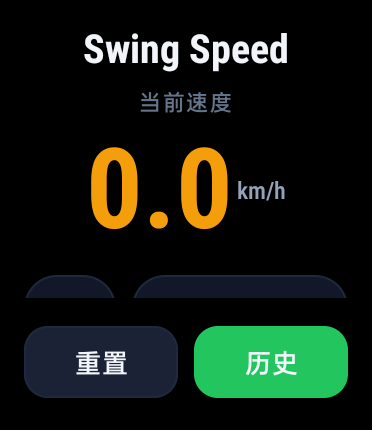
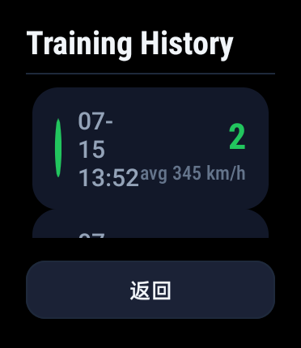

# Swing Speed - OPPO Watch 3

A badminton swing speed tracker built for OPPO Watch 3 (Wear OS). Uses the watch's accelerometer to detect swings, estimate racket-head speed, and log training sessions.

[中文](README_CN.md) | [日本語](README_JP.md)


## Features

- **Real-time swing speed** — displays current swing speed in km/h with large, glanceable numbers
- **Session statistics** — tracks swing count and average speed
- **Haptic feedback** — vibrates on each detected swing for instant confirmation
- **Training history** — saves every session to SQLite with timestamp, swing count, and average speed
- **Square-screen optimized** — UI designed for OPPO Watch 3's 372×430 AMOLED display
- **Always-on screen** — keeps CPU awake during training sessions

## Screenshots

| Main Screen | History |
|-------------|---------|
|  |  |

## Tech Stack

- **Language**: Java
- **Platform**: Android (Wear OS), minSdk 28
- **UI**: Android Views with Material Components
- **Sensors**: Accelerometer via Android Sensor API
- **Storage**: SQLite (SQLiteOpenHelper)
- **Build**: Gradle + Android Gradle Plugin 8.1

## How It Works

### Swing Detection Algorithm

The detector uses a phase state machine (IDLE → ACTIVE) to identify valid swings:

1. **Accelerometer** reports acceleration on X/Y/Z axes at ~50Hz
2. **Gravity compensation** — subtract 9.81 m/s² to get net movement force
3. **Low-pass filter** — 5-sample moving average to smooth noise
4. **Swing start** — triggered when 3 consecutive samples exceed 30 m/s² threshold
5. **Swing end** — confirmed when force stays below 25% of threshold for 60ms (hysteresis prevents multi-peak splitting)
6. **Validation** — swing must last 150ms–3000ms with minimum 3 samples
7. **Speed estimation** —  ≈ a_peak × r / t × 3.6 (km/h), where r = 0.5m (estimated swing radius)

### Architecture

`
MainActivity                — UI, sensor registration, screen wake lock
  VibratingCountDetector — Phase-state swing detection algorithm
  DatabaseHelper         — SQLite CRUD for training records

HistoryActivity             — ListView of past sessions with delete-on-long-press
  TrainingRecord         — Data model (id, timestamp, count, avgSpeed, maxSpeed)
`

## Building

### Prerequisites
- Android Studio Hedgehog or newer
- Android SDK with API 28+
- OPPO Watch 3 connected via ADB or Wear OS emulator

### Run from Android Studio
1. **File → Open** → select this project folder
2. Wait for Gradle sync
3. **Run → Run 'app'** → select your watch or emulator

### Build APK manually
`ash
./gradlew :app:assembleDebug
# Output: app/build/outputs/apk/debug/app-debug.apk
`

### Install via ADB
`ash
adb install app/build/outputs/apk/debug/app-debug.apk
`

## Project Structure

```
app/
  src/main/
    AndroidManifest.xml
    java/com/opposport/badminton/vibrationapp/
      MainActivity.java              # UI + sensor handling
      HistoryActivity.java           # Training history list
      VibratingCountDetector.java    # Swing detection algorithm
      DatabaseHelper.java            # SQLite helper
      TrainingRecord.java            # Data model
    res/
      drawable/                      # Icon vectors, card backgrounds
      layout/
        activity_main.xml            # Main screen (square-optimized)
        activity_history.xml         # History screen
        item_history.xml             # History row layout
      mipmap-anydpi-v26/             # Adaptive icon (API 26+)
      mipmap-*/                      # Raster icon fallbacks
      values/
        colors.xml                   # Semantic color tokens
        dimens.xml                   # Spacing & type scale
        strings.xml                  # UI strings
        styles.xml                   # Theme & component styles
  build.gradle                       # App module build config
  proguard-rules.pro
build.gradle                         # Root build file
gradle.properties
gradlew / gradlew.bat
gradle/wrapper/
local.properties
settings.gradle
```

## License

MIT
